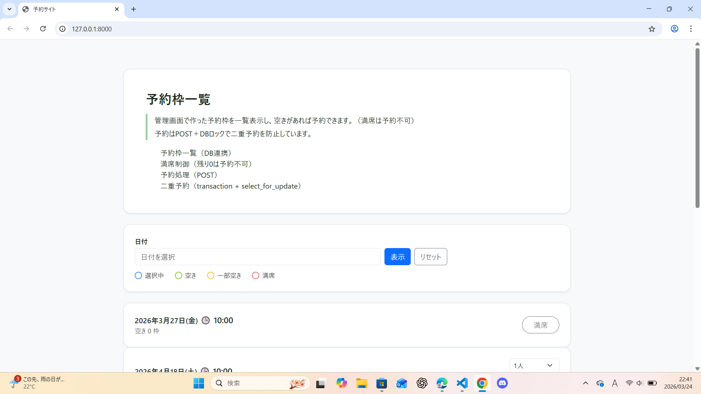
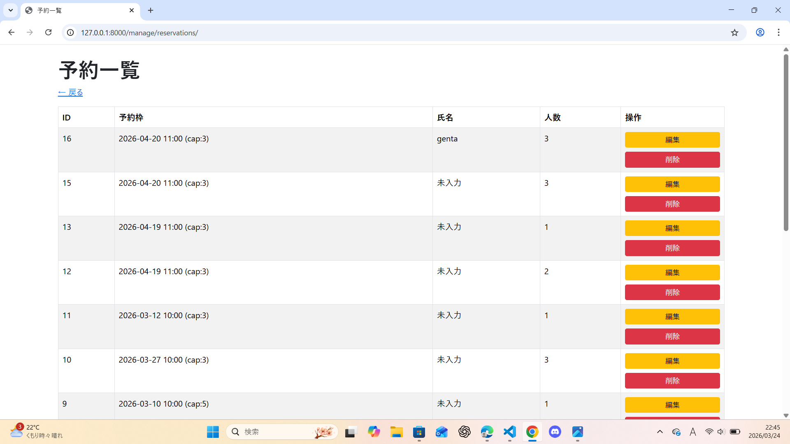
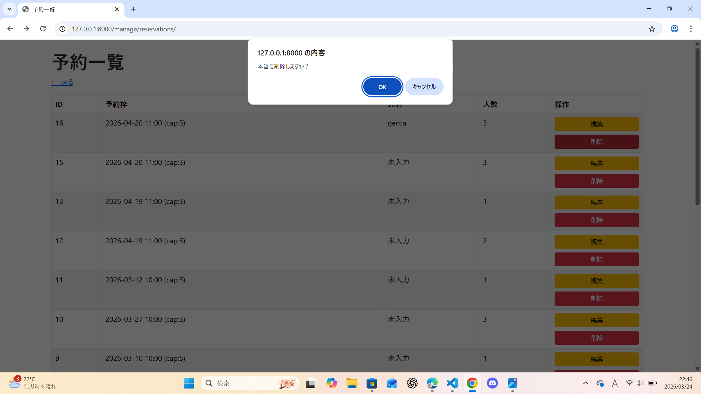

# 予約サイト（Django）

## 公開URL
https://django-reservation-site.onrender.com

## GitHub
https://github.com/genta1915/django-reservation-site

## 概要
- 管理画面から予約枠を作成し、ユーザー画面で一覧表示・予約ができるミニ予約サイトです。<br>
- Djangoを使用してDB連携と二重予約防止を実装しています。
- Renderを使用してWeb上にデプロイしています。

## 主な機能
- 予約枠一覧表示（DB連携）
- 満席制御（残り0は予約不可）
- 予約処理（POST）
- 二重予約防止（transaction.atomic + select_for_update）
- 日付選択で予約枠の表示切り替え
- 予約登録
- 予約キャンセル
- 管理者による予約枠作成
- 祝日表示
- 土日色分け表示

## 予約の流れ
1. 日付を選択
2. 空き予約枠を表示
3. 予約ボタンで予約実行
4. 予約完了ページを表示

## 技術ポイント
- Django 'transaction.atomic'を使った二重予約防止
- 'select_for_update'による排他制御
- Bootstrapを使ったUI構築
- AJAXを使用してページ遷移なしで予約枠を更新

## 使用技術
- Python / Django
- SQLite（開発用）
- HTML / CSS
- Bootstrap
- JavaScript
- Git / GitHub
- Render (デプロイ)

## ディレクトリ構成

```text
reservation_site/
├ images/              # README用スクリーンショット
├ reservation_site/    # Django設定
│  ├ __init__.py
│  ├ asgi.py
│  ├ settings.py
│  ├ urls.py
│  └ wsgi.py
├ reservations/        # 予約アプリ
│  ├ migrations/
│  ├ static/reservations/
│  │  ├ css/
│  │  └ js/
│  ├ templates/
│  │  ├ manage/
│  │  ├ registration/
│  │  └ reservations/
│  ├ __init__.py
│  ├ admin.py
│  ├ apps.py
│  ├ models.py
│  ├ tests.py
│  ├ urls.py
│  └ views.py
├ manage.py
└ README.md
```

## 画面

### 予約画面


### 管理画面


### 削除確認


## セットアップ
```bash
python3 -m venv venv
source venv/bin/activate
pip install -r requirements.txt
python3 manage.py migrate
python3 manage.py createsuperuser
python3 manage.py runserver
